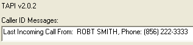



## TAPI Caller ID

### Description

Obtain Caller ID information via the TAPI API
 
### More Info
 
TAPI Caller ID Project

----

Gregory Fox

8/28/2007

gfox@veraterm.com

VB6 Project Group: _LevelA_TAPITest_GRP.vbg

Structure: ActiveX DLL with test form EXE

Uses: TAPI 2.0.2

The TAPI CallerID OCX I was using does not work with Win2003 Server,

so I decided to bite the bullet and see if I could dive into the

TAPI API from VB6.

It would have been easier to just buy another OCX, I suppose, but...

This project falls into the category of "you would think some simple examples

would be easily found on Google - but are not." I did find several starting

points which helped, namely code samples from (1) Ray Mercer and

(2) Brian Yule (on www.planet-source-code.com). Thanks for their posts.

I am posting this code as-is, so other Googlers can find help more easily.

This is a simple proof-of-concept program for getting Caller ID info from

a TAPI-compliant device. As I am not a TAPI API expert, there are many

aspects to this of which I am not aware (and not sure I need to be).

For example:

(1) I noticed (comments in the code) that the time delay between hanging

up and the LINECALLSTATE_IDLE msg is very long (about 5 sec). If a new

call comes in during this period, TAPI uses the SAME call structure.

Not sure if there is a simple way around it (like setting the idle delay),

so I coded around it, looking for changes to the CID info.

(2) With my laptop's modem, I get two LINE_CALLINFO msgs which appear to

be identical. Not sure if this is common, but even if not it needs to be

addressed (the fix for (1) also fixes this).

I am not providing a step-by step document. Coders should easily be able to

follow my code and the architecture to learn from it. The basic thing I

needed to learn first was the order of initialization/shut-down, and the

content of the callback method parms.

To use the test window:

1. Select proper device from the combo box

2. Click on &lt;Listen&gt;

3. Call your TAPI modem's line: note the debug window and the CID text box

4. Click on &lt;Close&gt; to disconnect

There were several important changes I needed to make to sample code snippets

that I found. First, padding in several of the UDT's needed to be in the

form of byte arrays - not fixed-len strings. Don't ask me why. Crashed

otherwise. Second, several code samples stored the obj ptr to the main class

in a global numerical variable. Can't do that! More crashes.

Coder Notes:

This structure has a DLL with 2 public classes:

CTAPIDeviceList - for enumeration of the device desc (also public)

CTAPICID - for caller ID info events

The main class in the DLL (as a singleton) is CTAPIAPP,

which is instantiated in Sub Main()

This is the structure I prefer for such components. Additional

functionality would require more public classes to encapsulate CTAPICID

             |
---                |---
**Submitted On**   |2007-08-30 21:36:26
**By**             |[Greg Fox](https://github.com/Planet-Source-Code/PSCIndex/blob/master/ByAuthor/greg-fox.md)
**Level**          |Advanced
**User Rating**    |5.0 (10 globes from 2 users)
**Compatibility**  |VB 6\.0
**Category**       |[Windows API Call/ Explanation](https://github.com/Planet-Source-Code/PSCIndex/blob/master/ByCategory/windows-api-call-explanation__1-39.md)
**World**          |[Visual Basic](https://github.com/Planet-Source-Code/PSCIndex/blob/master/ByWorld/visual-basic.md)
**Archive File**   |[TAPI\_Calle2081388302007\.zip](https://github.com/Planet-Source-Code/greg-fox-tapi-caller-id__1-69231/archive/master.zip)

